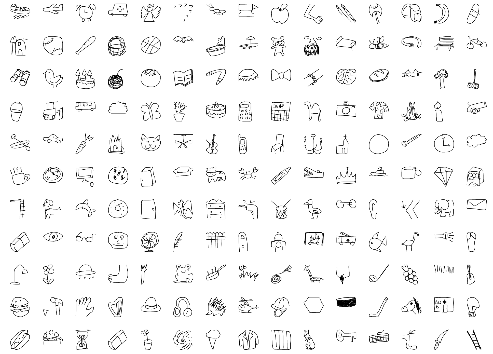

# The-Quick-Project
Over **15 million** players have contributed millions of drawings playing **Quick, Draw!** These doodles are a unique data set that can help developers train new neural networks, help researchers see patterns in how people around the world draw, and help artists create things we haven’t begun to think of. That's why these doodles are [freely available](https://quickdraw.withgoogle.com/) for everyone to play with:

There are several ways to retrieve the dataset, via a Google Cloud Platform API call or by manually downloading them from the [CGP server](https://console.cloud.google.com/storage/browser/quickdraw_dataset/full/numpy_bitmap;tab=objects?pli=1&prefix=&forceOnObjectsSortingFiltering=false).

In this repository you will find projects that use these drawings.